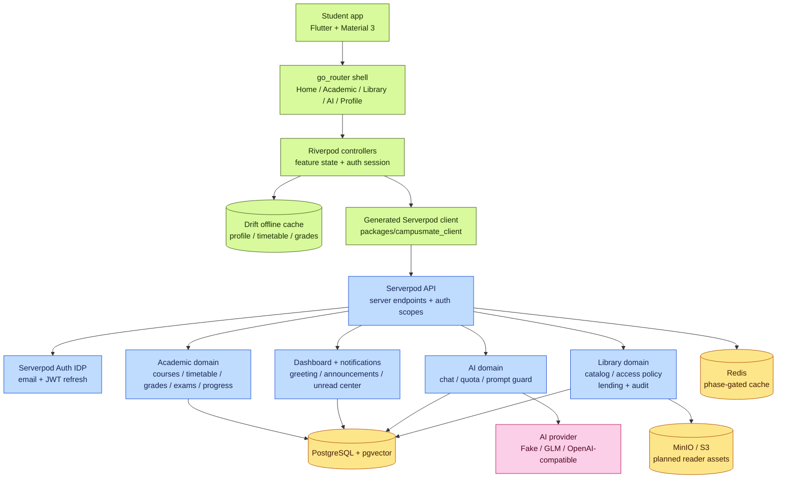
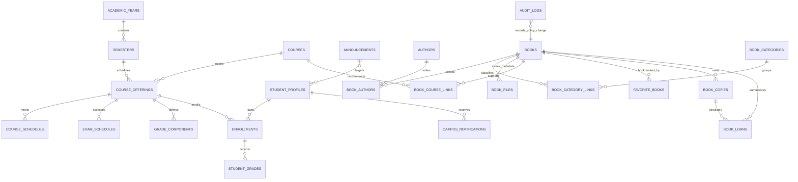

# CampusMate

**Study. Read. Grow.** — Ứng dụng di động dành cho sinh viên: quản lý học tập, thư viện sách điện tử và trợ lý AI cá nhân hóa, phát triển trên Flutter (frontend) và Serverpod (backend).

> Đây không phải ứng dụng chính thức của bất kỳ trường đại học nào. Không sử dụng logo, dữ liệu thật hay API của HCMUTE. Toàn bộ dữ liệu trong repository là mock/seed data giả lập; sách mẫu là tài liệu public domain hoặc tự tạo, chỉ phục vụ mục đích development/demo.

## Tổng quan

- **Quản lý học tập** — thời khóa biểu, điểm số, lịch thi và tiến độ theo học kỳ; hoạt động offline-first nhờ cache Drift trên máy.
- **Thư viện điện tử** — catalog sách, yêu thích, mượn/trả bản copy có kiểm soát (transaction + audit log) và trình đọc EPUB.
- **Trợ lý AI cá nhân hóa** — chat có RAG trên ngữ cảnh học vụ, hạn mức tin nhắn theo ngày, bảo vệ prompt-injection ở server.
- **Dashboard & thông báo** — lời chào, announcement, trung tâm chưa đọc cho từng sinh viên.
- **Phân quyền 4 scopes** — RBAC kiểm chứng hoàn toàn ở server; client không bao giờ giữ secret hay tự quyết định quyền.

## Kiến trúc hệ thống





## Nguyên tắc kiến trúc

Các quy tắc dưới đây là bất biến (invariant) và được kiểm chứng ở tầng server:

1. **Authorization tập trung ở server.** Mọi quyết định phân quyền được thực thi tại backend; client không bao giờ là nơi chốt quyền truy cập.
2. **Identity chỉ lấy từ session.** Server không tin `userId` hay bất kỳ trường định danh nào gửi lên từ payload.
3. **Mobile không giữ secret.** AI key (`AI_API_KEY`) và kết nối trực tiếp cơ sở dữ liệu chỉ tồn tại ở phía server; client chỉ nhận URL server qua `--dart-define`.
4. **Metadata và hành động do server quyết.** Chi tiết sách trả về theo `BookAccessPolicyService` (DTO metadata/action); cho mượn dùng server time, transaction kèm row lock và partial unique index để bảo đảm một copy chỉ có một active loan đang hoạt động.
5. **Không lộ chi tiết lưu trữ.** File URL và storage key không xuất hiện trong catalog API hay lending API.

## Cấu trúc repository

```text
.
├── apps/
│   └── mobile/                  # Flutter app — Material 3, Riverpod, go_router, Drift
├── packages/
│   ├── campusmate_client/       # Serverpod client (generated — không sửa tay)
│   └── campusmate_shared/       # Pure Dart domain logic dùng chung (vd: tính GPA)
├── server/                      # Serverpod 3.4.x — endpoints, migrations, RBAC, seed
│   ├── bin/                     # main.dart (server), gateway_server.dart (admin)
│   ├── config/                  # development.yaml, passwords.yaml, docker-compose.yaml
│   ├── lib/                     # Domain code: future/ + current/
│   ├── migrations/              # Migration history
│   └── test/                    # Unit + integration tests
├── docs/                        # Tài liệu kỹ thuật (xem bảng Tài liệu)
└── pubspec.yaml                 # Dart workspace root (server + packages)
```

## Tài liệu

Toàn bộ tài liệu kỹ thuật được quản lý tập trung tại **[docs/README.md](docs/README.md)** theo chuẩn AgentKit (AK) workflow.

**Kiến trúc & dữ liệu**

| Tài liệu | Nội dung |
|---|---|
| [docs/architecture.md](docs/architecture.md) | Sơ đồ hệ thống, trust boundaries, runtime dataflow |
| [docs/database.md](docs/database.md) | ERD học vụ, lược đồ bảng, quy tắc toàn vẹn dữ liệu |
| [docs/api.md](docs/api.md) | Danh mục Serverpod endpoints, parameters, DTOs |
| [docs/offline-sync.md](docs/offline-sync.md) | Offline pull-cache qua Drift SQLite, Last-Write-Wins progress sync |
| [docs/ai-architecture.md](docs/ai-architecture.md) | Kiến trúc AI assistant, provider abstraction, streaming protocol |
| [docs/rag.md](docs/rag.md) | RAG: chunking, embedding, pgvector, DB-level authorization filter |

**Bảo mật**

| Tài liệu | Nội dung |
|---|---|
| [docs/authentication.md](docs/authentication.md) | Cơ chế xác thực, token lifecycle, RBAC matrix 4 scopes |
| [docs/threat-model.md](docs/threat-model.md) | Phân tích STRIDE, mô hình bảo mật, kiểm chứng rủi ro cốt lõi |

**Phát triển & vận hành**

| Tài liệu | Nội dung |
|---|---|
| [docs/testing.md](docs/testing.md) | Chiến lược kiểm thử: Unit, Widget, Integration, E2E journey |
| [docs/deployment.md](docs/deployment.md) | Container hóa, Docker Compose, biến môi trường, migrations |
| [docs/git-workflow.md](docs/git-workflow.md) | Quy ước nhánh, Conventional Commits, quality gates |
| [docs/release-packages.md](docs/release-packages.md) | Chính sách GitHub Releases / GitHub Packages |
| [docs/adr/](docs/adr/) | Architecture Decision Records (ADR-001 đến ADR-008) |

## Yêu cầu kỹ thuật

| Thành phần | Phiên bản / điều kiện |
|---|---|
| Flutter | stable 3.44.x (khớp Dart SDK `^3.12.0` của app) |
| Docker Desktop | đang chạy, Linux engine |
| Serverpod CLI | pin 3.4.x (`dart pub global activate serverpod_cli`; không dùng 4.0.0-rc) |
| Windows | bật Developer Mode (`start ms-settings:developers`) — bắt buộc cho plugin symlinks khi build desktop |

Target di động hiện tại là Android/iOS. Platform `windows/` được thêm lại bằng `flutter create --platforms windows .` khi cần build desktop.

## Cài đặt và khởi động

```bash
# 1. Hạ tầng phát triển (PostgreSQL + pgvector, Redis, MinIO)
cd server
docker compose up -d
docker compose ps        # toàn bộ service phải ở trạng thái healthy

# 2. Backend (từ repository root)
cd ..
dart pub get
cd server
dart run bin/main.dart --apply-migrations   # giữ terminal này chạy

# 2b. Seed tài khoản demo (terminal riêng; dừng backend trước để tránh
#     trùng port, khởi động lại backend sau khi seed xong)
$env:CAMPUSMATE_SEED_PASSWORD = '<mật-khẩu-local, tối thiểu 12 ký tự>'
dart run bin/seed.dart --apply-migrations

# 3. Ứng dụng di động
cd ../apps/mobile
flutter pub get
flutter run -d <device>
```

Ghi chú:

- Seed tạo ba tài khoản local — `student001@`, `librarian@`, `admin@campusmate.local` — với password đặt qua `CAMPUSMATE_SEED_PASSWORD`. Chỉ dùng cho development; script seed idempotent, chạy lại được để cập nhật mà không tạo bản ghi trùng.
- Android emulator tự dùng `10.0.2.2` khi chưa truyền `--dart-define`; Android máy thật nên truyền `CAMPUSMATE_SERVER_URL` riêng trỏ tới địa chỉ LAN của server.
- Redis đang tắt trong config (`redis.enabled: false`); container vẫn chạy sẵn để bật cache ở phase sau mà không đổi hạ tầng.

## Kiểm thử

```bash
# Server — unit/offline tests (không cần Docker)
cd server && dart test --exclude-tags integration

# Server — full tests (cần Docker test services đang chạy)
cd server && dart test

# Mobile — phân tích, unit/widget test, build debug APK
cd apps/mobile && flutter analyze && flutter test
cd apps/mobile && flutter build apk --debug

# Spike gọi server thật (tùy chọn, cần backend đang chạy)
CAMPUSMATE_LIVE_SPIKE=1 flutter test test/client_spike_test.dart
```

CI/CD: GitHub Actions (`.github/workflows/mobile.yml` và `server.yml`) chạy đúng các bước format/analyze/test ở trên — Flutter 3.44 cho mobile, kèm containers PostgreSQL + pgvector và Redis cho server — trên mỗi push/PR vào `main`. Kết quả CI được đọc từ GitHub Actions, không suy ra từ kiểm tra local.

## Biến môi trường và AI runtime

Khai báo biến bắt buộc (không kèm giá trị secret) trong [.env.example](.env.example).

| Biến | Mô tả |
|---|---|
| `AI_PROVIDER` | `fake` (mặc định local) / `openai-compatible` / `glm`. `openai_compatible` được chấp nhận như alias tương thích. |
| `AI_BASE_URL`, `AI_CHAT_MODEL` | Bắt buộc khi dùng provider thật; thêm `AI_API_KEY` nếu gateway yêu cầu khóa. |
| `AI_DAILY_MESSAGE_QUOTA` | Hạn mức tin nhắn/ngày/người dùng, server-enforced, mặc định `50`. |
| `CAMPUSMATE_SERVER_URL` | URL backend, truyền cho app qua `--dart-define`. |

Bảo vệ prompt: server luôn chèn system prompt cố định và loại bỏ mọi `system` row trong history của client để giảm nguy cơ prompt-injection.

Credential PostgreSQL/Redis/JWT trong `server/config/passwords.yaml` và `server/docker-compose.yaml` là dev credential do template sinh, chỉ dùng machine-local; production nhận secret qua biến môi trường.

## Đóng góp

- Vui lòng xem hướng dẫn chi tiết tại **[CONTRIBUTING.md](CONTRIBUTING.md)**.
- Mỗi feature/fix một nhánh, commit theo Conventional Commits, PR vào `main`.
- Quality gates bắt buộc trước khi merge: `dart format` / `flutter analyze` / toàn bộ test ở [mục Kiểm thử](#kiểm-thử) phải xanh.
- Quy ước nhánh chi tiết: [docs/git-workflow.md](docs/git-workflow.md). Chính sách phát hành (Releases/Packages): [docs/release-packages.md](docs/release-packages.md).

## License

[MIT](LICENSE)
