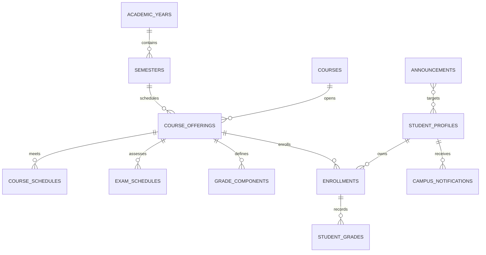

# CampusMate

**Study. Read. Grow.** — mobile app cho sinh viên đại học: quản lý học tập, thư viện sách điện tử online và trợ lý AI cá nhân hóa.

> Đây KHÔNG phải ứng dụng chính thức của bất kỳ trường đại học nào. Không sử dụng logo, dữ liệu thật hay API của HCMUTE. Toàn bộ dữ liệu trong repo là **mock/seed data giả lập**, sách mẫu là **public-domain hoặc tự tạo** — chỉ phục vụ development/demo.

## Kiến trúc




- **apps/mobile** — Flutter + Material 3 + Riverpod + go_router + Drift offline pull-cache.
- **server** — Serverpod 3.4.x (Dart), migrations, RBAC kiểm quyền ở server,
  dashboard và notification center derive user từ session.
- **packages/campusmate_client** — generated client (không sửa tay; dùng `serverpod generate`).
- **packages/campusmate_shared** — pure Dart domain logic dùng chung, ví dụ GPA calculation.
- **docs/architecture.md** — sơ đồ hệ thống, trust boundary và runtime flow.
- **docs/database.md** — ERD học vụ và quy tắc dữ liệu.
- **docs/release-packages.md** — chính sách GitHub Releases/GitHub Packages.
- **docs/adr/** — các quyết định kiến trúc quan trọng.

Quy tắc cứng: mobile không bao giờ giữ AI key hay kết nối DB trực tiếp; mọi authorization kiểm tra ở SERVER; identity chỉ lấy từ session (không tin `userId` từ payload).

## GitHub repository surface

Suggested About:

```text
CampusMate — Flutter + Serverpod student management, e-library, offline academic dashboard, and personalized AI assistant.
```

Suggested topics: `flutter`, `dart`, `serverpod`, `postgresql`, `pgvector`, `riverpod`, `drift`, `student-management`, `e-library`, `ai-assistant`.

Release/package policy:

- **GitHub Releases**: publish only tagged, evidence-backed builds after the matching local gates and GitHub Actions pass. Attach release notes from the plan ledger, not ad-hoc claims.
- **GitHub Packages**: use GitHub Packages/GHCR only for ship-ready server images or generated deliverables once a package workflow exists. Current CI builds a debug APK for verification, but does not publish packages yet.
- **Current state**: no production release is claimed until phases, CI, review, and live evidence are complete.

See [docs/release-packages.md](docs/release-packages.md) for the release and package contract.

## Prerequisites

- Flutter stable **3.44.x** + Dart 3.12 (khớp `sdk: ^3.12.0` của app).
- Docker Desktop (Linux engine) đang chạy.
- Windows: bật **Developer Mode** (`start ms-settings:developers`) — bắt buộc cho plugin symlinks khi build Windows desktop (Flutter yêu cầu). Mobile app hiện target Android/iOS; platform `windows/` sẽ thêm lại bằng `flutter create --platforms windows .` khi Dev Mode bật.
- Serverpod CLI (pin 3.4.x):
  ```bash
  dart pub global activate serverpod_cli
  serverpod --version   # kỳ vọng 3.4.x — KHÔNG dùng 4.0.0-rc
  ```
  Nếu `serverpod` không có trên PATH, executable nằm ở
  `%LOCALAPPDATA%\Pub\Cache\bin\serverpod.bat`.

## Quickstart

```bash
# 1. Hạ tầng dev (Postgres+pgvector, Redis, MinIO)
cd server
docker compose up -d
docker compose ps        # cả 5 service phải healthy

# 2. Backend (workspace root)
cd ..
dart pub get
cd server
dart run bin/main.dart --apply-migrations   # giữ terminal này chạy

# 2b. Seed demo accounts (chạy ở terminal riêng; dừng backend trước để tránh
#     trùng port, rồi khởi động lại backend sau khi seed xong)
$env:CAMPUSMATE_SEED_PASSWORD = '<mật-khẩu-local-it-nhất-12-ký-tự>'
dart run bin/seed.dart --apply-migrations

# Redis hiện đang tắt trong config (redis.enabled: false) — container vẫn chạy
# sẵn để bật cache ở phase sau mà không cần đổi hạ tầng.

# 3. Mobile app
cd ../apps/mobile
flutter pub get
flutter run -d <device>   # Android emulator sẽ tự dùng 10.0.2.2 nếu chưa có dart-define;
                          # Android máy thật nên truyền CAMPUSMATE_SERVER_URL riêng
```

## Tests

```bash
# Server unit/offline tests (không cần Docker)
cd server && dart test --exclude-tags integration

# Server full tests (cần docker compose test services đang chạy)
cd server && dart test

# Mobile
cd apps/mobile && flutter analyze && flutter test
cd apps/mobile && flutter build apk --debug

# Spike gọi server thật (tùy chọn, cần server đang chạy)
CAMPUSMATE_LIVE_SPIKE=1 flutter test test/client_spike_test.dart
```

## CI

GitHub Actions: `.github/workflows/mobile.yml` (format/analyze/test Flutter 3.44 + debug APK) và `.github/workflows/server.yml` (workspace pub get, format, analyze, `dart test` với service containers Postgres+pgvector/Redis). CI chạy trên push/PR vào `main`; kết quả CI phải được đọc từ GitHub Actions, không suy ra từ local checks.

## Demo accounts (phase 02+)

Tài khoản seed chỉ dành cho **local development** (tạo bởi seed script, không dùng production):

```text
student001@campusmate.local   — sinh viên demo
librarian@campusmate.local    — thủ thư
admin@campusmate.local        — quản trị
```

`CAMPUSMATE_SEED_PASSWORD` chỉ tồn tại trong môi trường local và không được
commit vào repo, CI, staging hoặc production. Script seed có thể chạy lại để
cập nhật password/profile mà không tạo bản ghi trùng.

## Environment variables

Xem `.env.example` (tên biến bắt buộc, không chứa secret). AI key chỉ nằm ở server (`AI_API_KEY`), mobile nhận URL qua `--dart-define=CAMPUSMATE_SERVER_URL`.

## AI runtime

- `AI_PROVIDER=fake` là mặc định cho local dev; đổi sang `openai-compatible` hoặc `glm` khi có `AI_BASE_URL`, `AI_CHAT_MODEL`, và khóa provider nếu gateway yêu cầu `AI_API_KEY`. `openai_compatible` vẫn được chấp nhận như alias tương thích.
- `AI_DAILY_MESSAGE_QUOTA` là hạn mức tin nhắn/ngày/người dùng, server-enforced, mặc định `50`.
- Server luôn chèn system prompt cố định và bỏ qua mọi `system` row nằm trong history để giảm prompt-injection.
- `server/test/integration/ai_endpoint_test.dart` cần Docker engine đang chạy; nếu không có Docker, gate này là `NOT_RUN`.

## Cảnh báo bảo mật dev

Password Postgres/Redis/JWT trong `server/config/passwords.yaml`, `server/docker-compose.yaml` là **credential dev do template sinh, machine-local** — không bao giờ tái sử dụng cho staging/production (production inject qua environment).

## Troubleshooting

- `Failed to bind socket, port 8080` → server cũ còn chạy: `netstat -ano | findstr :8080` → `taskkill /F /PID <pid>`.
- **Cổng 8080 bị dự án Docker khác chiếm** (vd một compose stack `infrastructure` chạy sẵn): đổi `port` trong `server/config/development.yaml` sang cổng khác (vd 8083), rồi truyền URL tương ứng cho app — `flutter run --dart-define=CAMPUSMATE_SERVER_URL=http://localhost:8083/` (Android emulator: `http://10.0.2.2:8083/`). Không commit phần đổi cổng này — nó là cấu hình machine-local.
- App trắng/không gọi được server khi `flutter run` → kiểm tra app đang trỏ tới đâu: mặc định không có `--dart-define` là `localhost:8080` (Android emulator `10.0.2.2:8080`); đảm bảo backend đang chạy đúng cổng đó (`curl http://localhost:<port>/` phải trả HTTP bất kỳ, không timeout).
- Docker daemon down sau khi máy sleep → mở Docker Desktop, chờ engine lên, `docker compose up -d` lại trong `server/`.
- `flutter pub get` báo Developer Mode trên Windows → bật Dev Mode hoặc xóa platform `windows/` (chỉ build Android/iOS).
- Page/server lỗi 503 khi GET root `/` trên port 8080 là hành vi bình thường (protocol endpoint); test thật bằng client call (spike test).

## Roadmap

Xem `plans/260830-1629-campusmate-student-management-e-library-ai/` — 12 phase, mỗi phase có exit criteria + verification commands.
