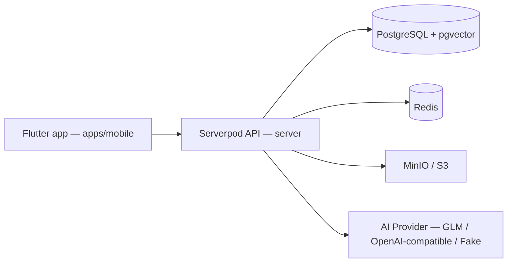

# CampusMate

**Study. Read. Grow.** — mobile app cho sinh viên đại học: quản lý học tập, thư viện sách điện tử online và trợ lý AI cá nhân hóa.

> Đây KHÔNG phải ứng dụng chính thức của bất kỳ trường đại học nào. Không sử dụng logo, dữ liệu thật hay API của HCMUTE. Toàn bộ dữ liệu trong repo là **mock/seed data giả lập**, sách mẫu là **public-domain hoặc tự tạo** — chỉ phục vụ development/demo.

## Kiến trúc



- **apps/mobile** — Flutter + Material 3 + Riverpod + go_router (+ Drift offline ở phase sau).
- **server** — Serverpod 3.4.x (Dart), migrations, RBAC kiểm quyền ở server.
- **packages/campusmate_client** — generated client (không sửa tay; dùng `serverpod generate`).
- **docs/adr/** — các quyết định kiến trúc quan trọng.

Quy tắc cứng: mobile không bao giờ giữ AI key hay kết nối DB trực tiếp; mọi authorization kiểm tra ở SERVER; identity chỉ lấy từ session (không tin `userId` từ payload).

## Prerequisites

- Flutter stable **3.44.x** + Dart 3.12 (khớp `sdk: ^3.12.0` của app).
- Docker Desktop (Linux engine) đang chạy.
- Windows: bật **Developer Mode** (`start ms-settings:developers`) — bắt buộc cho plugin symlinks khi build Windows desktop (Flutter yêu cầu). Mobile app hiện target Android/iOS; platform `windows/` sẽ thêm lại bằng `flutter create --platforms windows .` khi Dev Mode bật.
- Serverpod CLI (pin 3.4.x):
  ```bash
  dart pub global activate serverpod_cli
  serverpod --version   # kỳ vọng 3.4.x — KHÔNG dùng 4.0.0-rc
  ```
  Nếu `serverpod` không có trên PATH, executable nằm ở
  `%LOCALAPPDATA%\Pub\Cache\bin\serverpod.bat`.

## Quickstart

```bash
# 1. Hạ tầng dev (Postgres+pgvector, Redis, MinIO)
cd server
docker compose up -d
docker compose ps        # cả 5 service phải healthy

# 2. Backend (workspace root)
cd ..
dart pub get
cd server
dart run bin/main.dart --apply-migrations   # giữ terminal này chạy

# Redis hiện đang tắt trong config (redis.enabled: false) — container vẫn chạy
# sẵn để bật cache ở phase sau mà không cần đổi hạ tầng.

# 3. Mobile app
cd ../apps/mobile
flutter pub get
flutter run -d <device>   # Android emulator: server URL mặc định trỏ localhost;
                          # emulator dùng --dart-define=CAMPUSMATE_SERVER_URL=http://10.0.2.2:8080/
```

## Tests

```bash
# Server (cần docker compose test services đang chạy)
cd server && dart test

# Mobile
cd apps/mobile && flutter analyze && flutter test

# Spike gọi server thật (tùy chọn, cần server đang chạy)
CAMPUSMATE_LIVE_SPIKE=1 flutter test test/client_spike_test.dart
```

## CI

GitHub Actions: `.github/workflows/mobile.yml` (format/analyze/test Flutter 3.44) và `.github/workflows/server.yml` (workspace pub get, format, analyze, `dart test` với service containers Postgres+pgvector/Redis). Repo cần remote GitHub để CI chạy — khi chưa có remote, trạng thái CI được ghi `NOT_RUN` trung thực.

## Demo accounts (phase 02+)

Tài khoản seed chỉ dành cho **local development** (tạo bởi seed script, không dùng production):

```text
student001@campusmate.local   — sinh viên demo
librarian@campusmate.local    — thủ thư
admin@campusmate.local        — quản trị
```

## Environment variables

Xem `.env.example` (tên biến bắt buộc, không chứa secret). AI key chỉ nằm ở server (`AI_API_KEY`), mobile nhận URL qua `--dart-define=CAMPUSMATE_SERVER_URL`.

## Cảnh báo bảo mật dev

Password Postgres/Redis/JWT trong `server/config/passwords.yaml`, `server/docker-compose.yaml` là **credential dev do template sinh, machine-local** — không bao giờ tái sử dụng cho staging/production (production inject qua environment).

## Troubleshooting

- `Failed to bind socket, port 8080` → server cũ còn chạy: `netstat -ano | findstr :8080` → `taskkill /F /PID <pid>`.
- Docker daemon down sau khi máy sleep → mở Docker Desktop, chờ engine lên, `docker compose up -d` lại trong `server/`.
- `flutter pub get` báo Developer Mode trên Windows → bật Dev Mode hoặc xóa platform `windows/` (chỉ build Android/iOS).
- Page/server lỗi 503 khi GET root `/` trên port 8080 là hành vi bình thường (protocol endpoint); test thật bằng client call (spike test).

## Roadmap

Xem `plans/260830-1629-campusmate-student-management-e-library-ai/` — 12 phase, mỗi phase có exit criteria + verification commands.
