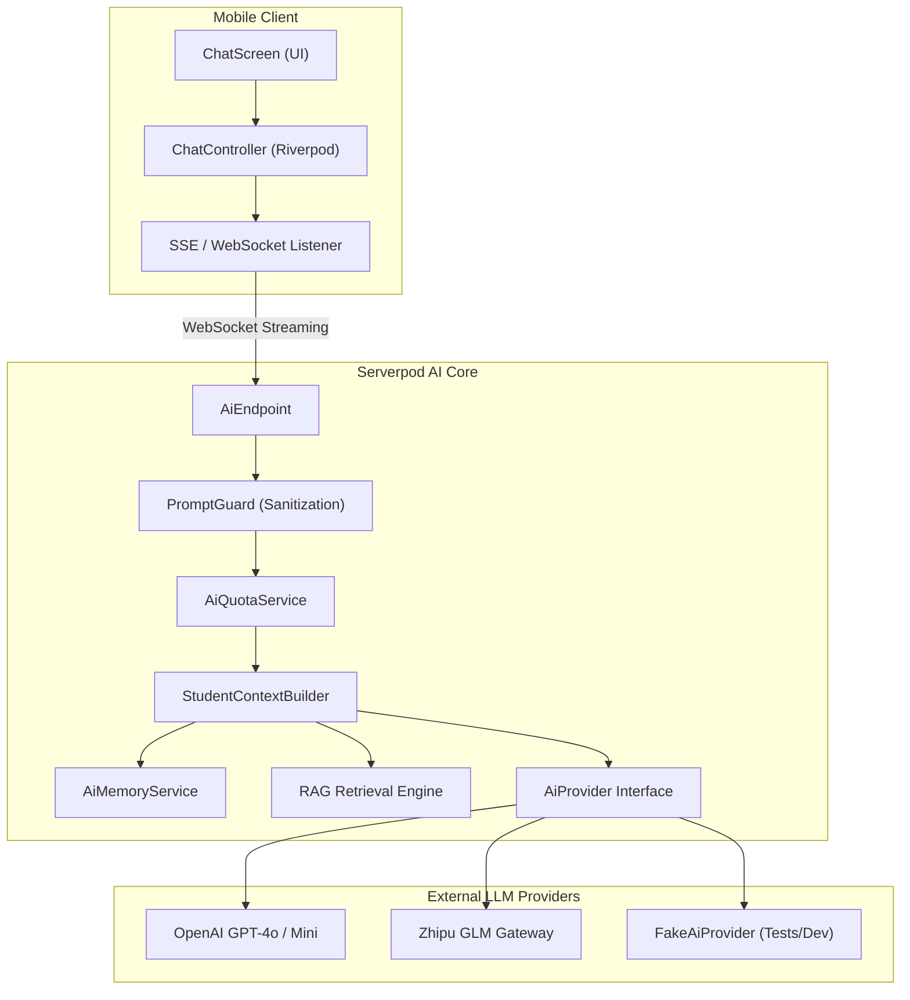

# CampusMate AI Assistant Architecture

CampusMate features an AI assistant designed to support student academics, textbook comprehension, and personalized study planning.

---

## 1. Architectural Overview



---

## 2. Key Components

### 2.1 Provider Abstraction (`AiProvider`)
All LLM interactions are decoupled behind the pure Dart `AiProvider` interface:
```dart
abstract class AiProvider {
  Stream<String> generateStream({
    required List<ChatMessage> messages,
    required AiRequestOptions options,
  });

  Future<List<double>> embedText(String text);
}
```
Implementations:
- `OpenAiProvider`: Production provider for OpenAI / Azure OpenAI endpoints.
- `GlmAiProvider`: Alternative high-speed provider.
- `FakeAiProvider`: Deterministic local provider used for continuous integration, local testing, and offline development without incurred API costs.

### 2.2 Student Context Augmentation (`StudentContextBuilder`)
When a student interacts with the AI, the backend automatically augments the system prompt with:
1. **Academic Snapshot**: Enrolled courses, upcoming exam dates (e.g., "Exam in 11 days"), and current semester.
2. **Student AI Preferences**: Explanation style (`socratic`, `concise`, `detailed`, `eli5`, `standard`).
3. **User-Controlled Memories**: Long-term preferences stated by the user (e.g., "Prefers Flutter code examples"), which can be reviewed, deactivated, or deleted by the student at any time.

### 2.3 Streaming Response Protocol
Responses stream over Serverpod streaming endpoints via WebSockets. Each text token is pushed to the client immediately upon generation, enabling low-latency, real-time typing indicators without polling.

### 2.4 Quota and Rate Limiting
To prevent denial of service and unexpected token usage:
- Daily token and interaction limits are enforced by `AiQuotaService`.
- Exceeding daily usage triggers an HTTP 429 response informing the user of the quota reset window.
