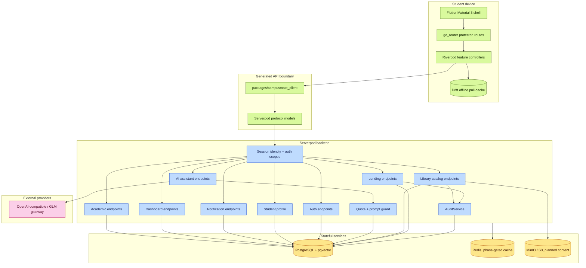
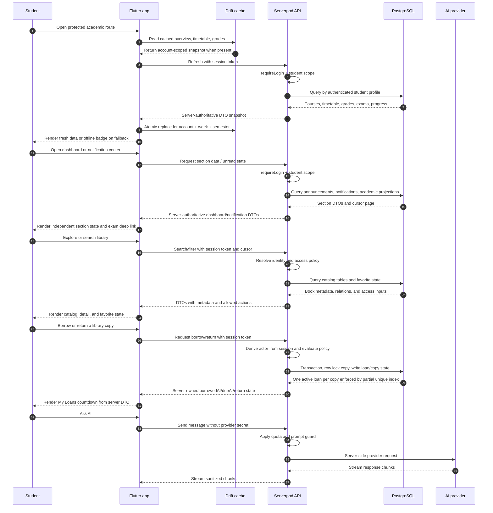

# CampusMate System Architecture

CampusMate is a Flutter + Serverpod student application. The mobile client owns presentation state and offline read cache only; the backend owns identity, authorization, domain rules, AI provider access, and durable data.

## System Map

## Runtime Flow

## Trust Boundaries

- The mobile app never stores AI provider keys and never connects directly to the database.
- Client payloads never decide the acting user. Endpoints derive identity from the Serverpod session.
- Offline academic data is a pull-cache. Server data remains authoritative, and cache rows are partitioned by authenticated account, week, and semester.
- Notification rows are user-scoped on the server; mobile deep links map typed
  notification targets to guarded app routes.
- Library catalog and lending access checks are server-owned before mobile receives metadata or action flags. Borrow/return uses server time and DB transactions; the client never decides due dates or acting user.
- Privileged library mutations call `AuditService`, which sanitizes metadata before writing `audit_logs`.
- Reader/RAG phases must keep file URL, storage key, and retrieval authorization behind the same server boundary.
- Release claims require local gates, independent review, GitHub Actions evidence, and explicit tag/package evidence.

## Component Ownership

| Component | Owner | Current status |
| --- | --- | --- |
| `apps/mobile` | Flutter client, routing, Riverpod controllers, Drift read cache | Active |
| `server` | Serverpod endpoints, auth, library/lending policy, audit, migrations, seed data | Active |
| `packages/campusmate_client` | Generated protocol/client | Generated |
| `packages/campusmate_shared` | Pure Dart reusable domain logic | Active |
| `docs/adr` | Architecture decisions | Active |
