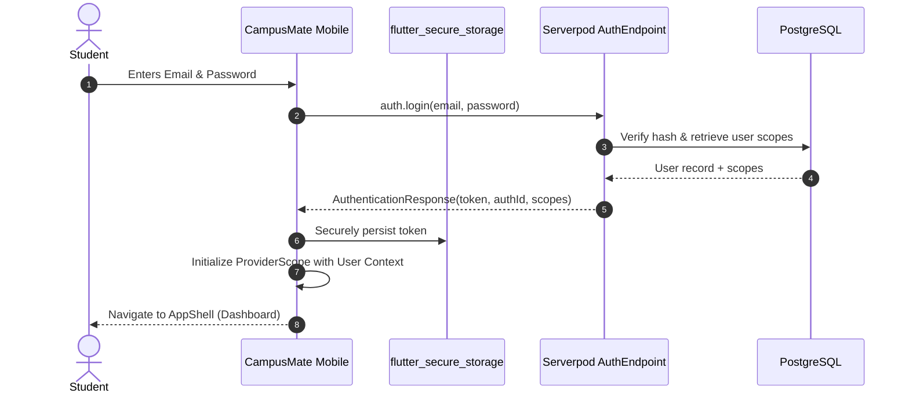

# CampusMate Authentication & Authorization Guide

CampusMate employs a token-based, scope-gated authentication architecture built on Serverpod session security.

---

## 1. Role-Based Access Control (RBAC) Matrix

The system defines 4 distinct role scopes:

| Scope Token | Role Name | Allowed Capabilities |
|---|---|---|
| `campusmate.student` | Student | View own profile, enrolled courses, timetable, exams, GPA; search library, borrow/return books; read ebooks; chat with personalized AI; sync progress. |
| `campusmate.lecturer` | Lecturer | View taught courses, submit student grades, view student rosters, manage course documents. |
| `campusmate.librarian` | Librarian | Catalog books, upload PDF/EPUB assets, manage copies, update access policies, process manual returns. |
| `campusmate.admin` | Administrator | System-wide administrative rights: student onboarding, role assignment, announcement broadcast, immutable audit log inspection. |

---

## 2. Authentication Flow

---

## 3. Session & Token Lifecycle

1. **Storage**: Tokens are stored encrypted on the mobile device via `flutter_secure_storage` (backed by Android Keystore on Android and Apple Keychain on iOS). No credentials or tokens are saved in unencrypted SharedPreferences or SQLite.
2. **Transmission**: Every API request sends the session token in the authorization header via the Serverpod client protocol.
3. **Validation**: Serverpod validates the token signature, checks expiration, and retrieves assigned scopes from the active session cache.
4. **Tenant Isolation**: Endpoints strictly extract `session.authenticated.userId` on the server. Client-provided user IDs are discarded, completely preventing Insecure Direct Object Reference (IDOR) vulnerabilities.
5. **Session Revocation**: Logging out deletes the stored token locally and invalidates the session key on the Serverpod backend.
