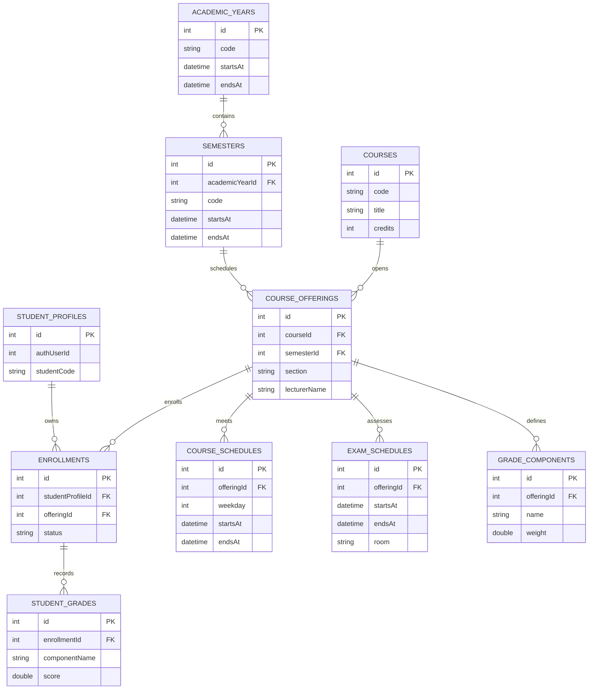
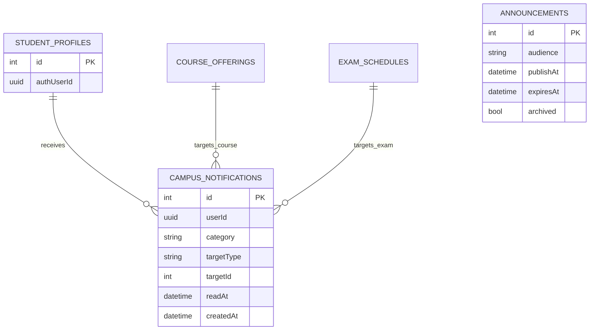
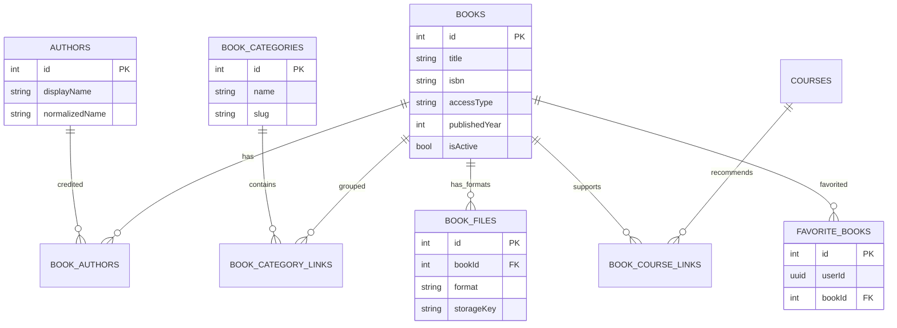
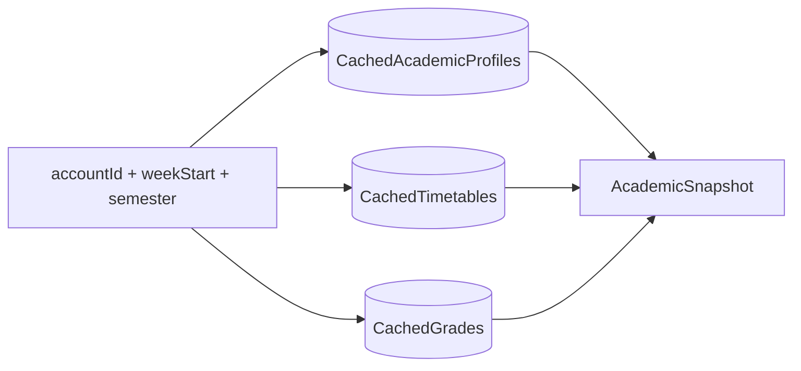

# CampusMate Database Model

The database is Serverpod-owned. Mobile clients receive DTOs through generated clients and cache selected read models locally with Drift.

## Academic ERD

## Dashboard And Notifications

## Library Catalog

## Data Rules

- Academic rows are demo data only. They are intentionally fake and must not imply an official university integration.
- Foreign keys are explicit in the Serverpod schema and generated migration.
- Read APIs scope from `StudentProfile.authUserId`, never from a caller-supplied student id.
- Weekly and daily timetable queries project recurring schedules only inside the semester/course schedule window.
- Grade summaries use `packages/campusmate_shared` so policy changes are tested outside UI code.
- `student_grades.componentName` stores the component label used for the recorded score; the canonical component plan remains attached to the course offering through `grade_components`.
- Dashboard announcements are filtered by audience, publish window, and archive
  state before they reach mobile.
- Notifications support the allowed category set
  `academic/library/system/ai/course/exam`; list pagination is keyset-based by
  `(createdAt, id)` and scoped to the authenticated user.
- Library catalog APIs return DTOs owned by generated Serverpod protocol. Search
  pagination is cursor-based and filter resolution happens before querying book
  rows. Catalog detail may expose available formats and action flags, but not
  storage keys or reader file URLs.
- Library access decisions are owned by `BookAccessPolicyService`; mobile uses
  its returned action flags instead of reimplementing role rules.

## Local Cache Shape

The Drift cache is replaced transactionally after a successful server refresh. Logout or account switch must never read another account's cached rows.
