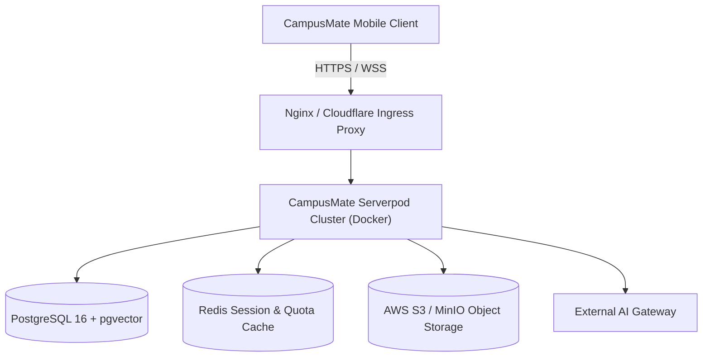

# CampusMate Production Deployment Guide

This document describes the deployment architecture, container setup, database migration process, and infrastructure requirements for CampusMate.

---

## 1. Production Architecture



---

## 2. Environment Variables & Configuration

The Serverpod backend is configured via `server/config/production.yaml` and environment variables:

| Variable | Description | Example / Recommended Value |
|---|---|---|
| `SERVERPOD_RUN_MODE` | Runtime environment | `production` |
| `SERVERPOD_PASSWORD` | Database user password | *Strong 32+ character secret* |
| `SERVERPOD_DATABASE_HOST` | PostgreSQL hostname | `postgres.internal` |
| `SERVERPOD_DATABASE_PORT` | PostgreSQL port | `5432` |
| `SERVERPOD_DATABASE_NAME` | Database name | `campusmate_prod` |
| `SERVERPOD_REDIS_HOST` | Redis cache host | `redis.internal` |
| `SERVERPOD_AI_PROVIDER_KEY`| Production AI Gateway key | `sk-...` |

---

## 3. Database Migration Workflow

Serverpod manages database schemas via versioned migrations:

```bash
# Apply pending production migrations safely before starting backend
serverpod-server --mode production --apply-migrations

# In case of repair or drift inspection
serverpod-server --mode production --apply-repair-migration
```

---

## 4. Container Deployment (Docker Compose)

Production containers are deployed using multi-stage Docker builds:

```yaml
services:
  campusmate_server:
    image: ghcr.io/jasontm17/campusmate-server:latest
    restart: always
    environment:
      - SERVERPOD_RUN_MODE=production
    ports:
      - "8080:8080"
      - "8081:8081"
    depends_on:
      postgres:
        condition: service_healthy
      redis:
        condition: service_healthy

  postgres:
    image: pgvector/pgvector:pg16
    restart: always
    volumes:
      - postgres_data:/var/lib/postgresql/data
    environment:
      POSTGRES_DB: campusmate_prod
      POSTGRES_USER: campusmate
      POSTGRES_PASSWORD: ${DATABASE_PASSWORD}

  redis:
    image: redis:7-alpine
    restart: always
```
