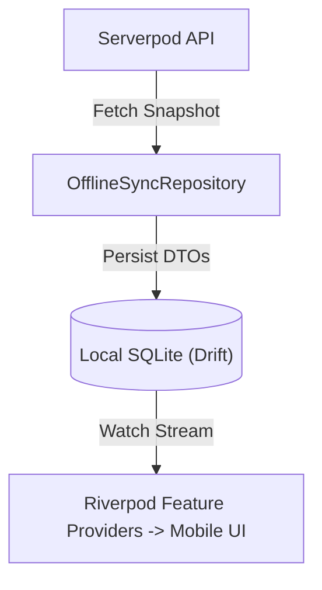

# CampusMate Offline Architecture & Data Synchronization

CampusMate is designed for reliable operation in campus environments with intermittent cellular or Wi-Fi connectivity.

---

## 1. Architectural Model

CampusMate follows a **server-authoritative, pull-cache** model:
- The backend is the single source of truth for all academic, library, and user data.
- The mobile app maintains a read-only offline cache powered by **Drift (SQLite)**.
- Only one specific client-write channel exists: **Reading Progress Synchronization**.

---

## 2. Local Cache Hierarchy (Drift)



The local Drift database caches:
- `CachedAcademicOverview`: Academic standing, semester timetable, grades, exam dates.
- `CachedBookMetadata`: Catalog books, favorited titles, active loans.
- `CachedReaderBookmarks`: Local bookmarks, highlights, and annotations.

---

## 3. Last-Write-Wins (LWW) Reading Progress Sync Protocol

When students read ebooks offline on a phone and later switch to a tablet or laptop, reading progress updates must resolve deterministically without data loss or rollback.

### Protocol Invariant:
1. Every progress update sent by a client includes:
   - `bookId`: Target book ID
   - `progressPercent`: Float between 0.0 and 100.0
   - `currentLocation`: CFI (EPUB) or page number (PDF)
   - `clientUpdatedAt`: Monotonic UTC timestamp recorded at the exact moment of the reading action
2. **Server Resolution Algorithm**:
   ```dart
   if (existingProgress == null || clientUpdatedAt.isAfter(existingProgress.updatedAt)) {
     // Client update is newer: apply to database
     await saveProgress(clientUpdate);
     return ReadingProgressSyncResult(appliedClientUpdate: true, ...);
   } else {
     // Client update is stale (from older offline session): reject mutation
     return ReadingProgressSyncResult(appliedClientUpdate: false, ...);
   }
   ```
3. Verified in tests:
   - `server/test/integration/student_e2e_journey_test.dart`
   - `apps/mobile/test/integration/student_application_flow_test.dart`
