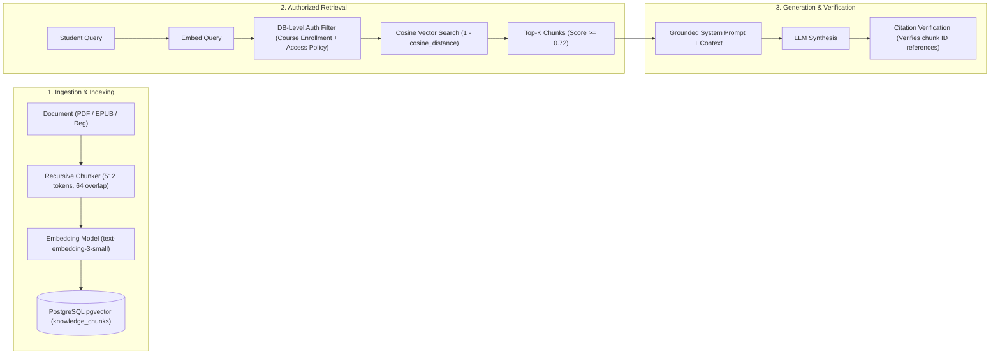

# CampusMate RAG (Retrieval-Augmented Generation) Architecture

CampusMate implements an enterprise-grade, authorization-aware Retrieval-Augmented Generation (RAG) pipeline to ground AI responses in university course materials, regulations, and e-library textbooks.

---

## 1. RAG Pipeline Stages



---

## 2. Authorization-Aware Vector Search (DB-Level Filtering)

A critical vulnerability in typical RAG systems is cross-tenant information leakage (Risk R4). CampusMate prevents this by executing access checks directly within the PostgreSQL query:

```sql
SELECT c.id, c.content, c.metadata, (1 - (c.embedding <=> $1)) as similarity
FROM knowledge_chunks c
JOIN knowledge_documents d ON c.document_id = d.id
WHERE (
    d.access_type = 'public'
    OR (d.access_type = 'course_restricted' AND d.course_id IN (
        SELECT offering_id FROM enrollments WHERE student_profile_id = $2 AND status = 'active'
    ))
    OR (d.access_type = 'borrow_required' AND d.book_id IN (
        SELECT book_id FROM book_loans WHERE student_id = $3 AND status = 'borrowed'
    ))
)
ORDER BY c.embedding <=> $1
LIMIT 5;
```

**Security Invariant**: If a student is not enrolled in a course or does not hold an active loan for a restricted book, the corresponding chunks are excluded at the database layer. The LLM never sees unauthorized text.

---

## 3. Citation Verification & Anti-Hallucination

1. **Source Grounding**: Prompts instruct the LLM to tag factual claims with inline bracketed source IDs: `[Doc #12, Page 45]`.
2. **Post-Processing Verifier**: `CitationVerifier` scans the generated response, cross-references tagged citation tokens against the retrieved chunk metadata, and flags or removes fabricated citations before delivering the text to the client.
