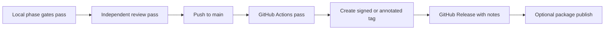

# GitHub Releases and Packages

CampusMate uses evidence-backed release discipline. A release is not considered shipped because code exists locally; it needs a tag, passing GitHub Actions, review evidence, and a published artifact.

## Repository About

Current GitHub About description for `JasonTM17/CampusMate`:

```text
CampusMate — Flutter + Serverpod student management, e-library, offline academic dashboard, and personalized AI assistant.
```

Current topics: `flutter`, `dart`, `serverpod`, `postgresql`, `pgvector`, `riverpod`, `drift`, `student-management`, `e-library`, `ai-assistant`.

## Release Contract



Required release evidence:

- exact commit hash and tag;
- local format, analyze, test, and build commands with result;
- GitHub Actions run URLs and conclusions;
- reviewer verdict and remaining risks;
- release notes derived from `plans/260830-1629-campusmate-student-management-e-library-ai/reports/execution-ledger.md`;
- rollback instruction for the published artifact.

## Package Policy

GitHub Packages/GHCR is reserved for ship-ready artifacts:

- backend container images after a Dockerfile and package workflow exist;
- generated debug APKs only as CI artifacts, not package releases;
- production mobile builds only after signing, store/distribution policy, and release gates are complete.

Current status:
- **GitHub Packages (GHCR)**:
  - `ghcr.io/jasontm17/campusmate-server:latest` (linked to `JasonTM17/CampusMate`)
  - `ghcr.io/jasontm17/campusmate:latest` (linked to `JasonTM17/CampusMate`)
  - Package listings: [https://github.com/users/JasonTM17/packages/container/package/campusmate-server](https://github.com/users/JasonTM17/packages/container/package/campusmate-server)
- **Docker Hub**:
  - `docker.io/nguyenson1710/campusmate-server:latest` & `1.0.0`
  - `docker.io/nguyenson1710/campusmate:latest`
  - Docker Hub listings: [https://hub.docker.com/r/nguyenson1710/campusmate-server](https://hub.docker.com/r/nguyenson1710/campusmate-server)
