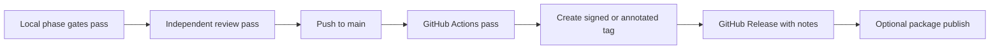

# GitHub Releases and Packages

CampusMate uses evidence-backed release discipline. A release is not considered shipped because code exists locally; it needs a tag, passing GitHub Actions, review evidence, and a published artifact.

## Repository About

Current GitHub About description:

```text
CampusMate — Flutter + Serverpod student management, e-library, offline academic dashboard, and personalized AI assistant.
```

Current recommended topics: `flutter`, `dart`, `serverpod`, `postgresql`, `pgvector`, `riverpod`, `drift`, `student-management`, `e-library`, `ai-assistant`.

## Release Contract



Required release evidence:

- exact commit hash and tag;
- local format, analyze, test, and build commands with result;
- GitHub Actions run URLs and conclusions;
- reviewer verdict and remaining risks;
- release notes derived from `plans/260830-1629-campusmate-student-management-e-library-ai/reports/execution-ledger.md`;
- rollback instruction for the published artifact.

## Package Policy

GitHub Packages/GHCR is reserved for ship-ready artifacts:

- backend container images after a Dockerfile and package workflow exist;
- generated debug APKs only as CI artifacts, not package releases;
- production mobile builds only after signing, store/distribution policy, and release gates are complete.

Current status: the repository has CI workflows and a local debug APK gate, but there is no published GitHub Release and no GitHub Packages workflow yet. That is intentional until the project reaches the release phase.
