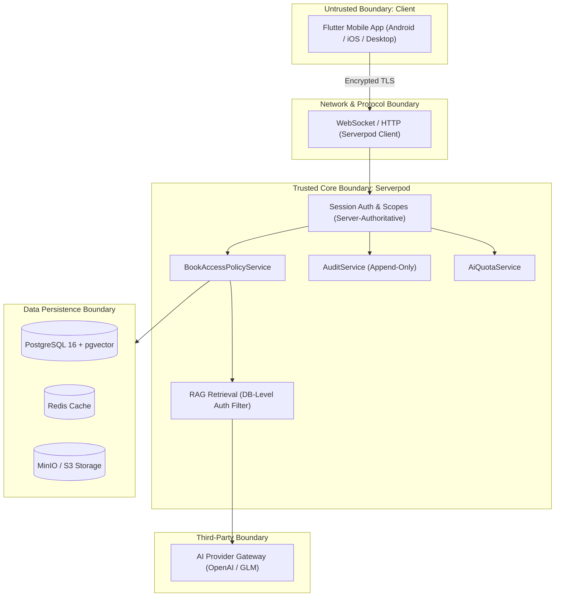

# CampusMate Application Threat Model & Security Architecture

This document formalizes the threat model for the CampusMate monorepo in accordance with §83 of the architectural blueprint. It applies STRIDE methodology and details the 11 key risks along with their verified mitigations and automated test evidence.

---

## 1. System Trust Boundaries

The CampusMate architecture establishes four strict trust boundaries:

1. **Client Boundary**: The mobile application runs on user-controlled devices and is treated as **untrusted**. No server secrets or AI provider keys are stored on the mobile device. Client requests are verified through cryptographic session authentication.
2. **Identity & Authorization Boundary**: The server derives user identity and authorization scopes solely from the authenticated session context, completely ignoring any user identifier fields passed in request payloads.
3. **LLM Boundary**: User prompts and knowledge documents are treated as untrusted input. Documents must pass database-level permission filtering before text chunks are passed to the language model.
4. **Storage & Content Boundary**: Direct object storage keys are never exposed to clients. Document downloads and streaming assets utilize time-limited (15-minute) signed asset endpoints verified by `BookAccessPolicyService`.

---

## 2. STRIDE Analysis & The 11 Core Risks (§83)

| # | Risk Description | STRIDE Category | Mitigation Strategy | Test Verification Evidence |
|---|---|---|---|---|
| **R1** | **IDOR on Student Profile & Academic Data** Student A submits Student B's UUID to view/edit grades, schedule, or profile. | Elevation of Privilege / Info Disclosure | Server endpoints (`studentProfile`, `academic`) strictly bind to `session.authenticated` identity. Payload UUIDs are ignored. Non-student scopes are rejected. | `server/test/integration/student_profile_endpoint_test.dart` `server/test/integration/academic_endpoint_test.dart` `server/test/integration/rbac_matrix_test.dart` (PASS) |
| **R2** | **Concurrent Borrow Race Condition** Multiple users concurrently attempt to borrow the last available physical or digital book copy. | Tampering / Repudiation | Database-level row locking (`SELECT FOR UPDATE`) within Serverpod transactions + partial unique index `book_loans_active_copy_idx` on active loans. Exactly one request succeeds (HTTP 200); concurrent requests receive HTTP 409 Conflict. | `server/test/integration/lending_endpoint_test.dart` (Deterministic race test verifies exactly 1 active loan created among concurrent callers) (PASS) |
| **R3** | **Unauthorized eBook Content Access** User requests book content or downloads without meeting the 5-tier access policy or possessing an active loan. | Information Disclosure | `BookAccessPolicyService` is the single authority for document access. Reading asset URLs are short-lived (15 minutes) and generated only after policy validation. | `server/test/integration/library_endpoint_test.dart` `server/test/integration/student_e2e_journey_test.dart` (PASS) |
| **R4** | **RAG Authorization Bypass & Cross-Course Leakage** Student queries AI assistant to retrieve restricted syllabus, exam questions, or documents of courses they are not enrolled in. | Information Disclosure | DB-level authorization filter executed in PostgreSQL *before* vector similarity retrieval. Restricted documents never reach LLM context (0 chunks retrieved for unauthorized courses). | `server/test/integration/rag_test.dart` (Negative authorization test verifies 0 chunks retrieved for restricted doc) (PASS) |
| **R5** | **Prompt Injection & System Prompt Extraction** Malicious prompt attempts to override system role, forge grades, or leak confidential context. | Tampering / Info Disclosure | Multi-layer defense: system instructions separated from user input using structured XML delimiter framing (`<user_prompt>`), user input length truncation, and regex-based prompt injection detection in `PromptGuard`. | `server/test/integration/ai_endpoint_test.dart` `server/test/fixtures/prompt_injection_fixtures.dart` (PASS) |
| **R6** | **AI Quota Abuse & DoS Attacks** Attacker floods streaming chat endpoint with massive prompts or endless requests to exhaust server resources or incur cloud billing spikes. | Denial of Service | Server-side quota tracking via `AiQuotaService`. Limits daily user turns and token budgets. Excessive requests receive HTTP 429 with reset metadata. | `server/test/integration/ai_endpoint_test.dart` (PASS) |
| **R7** | **Offline Cache Tampering & Policy Expiration** Client manipulates local SQLite Drift database to read expired borrowed books or forge cached grades. | Tampering / Info Disclosure | Local Drift database enforces schema constraints. Downloaded files are encrypted using device-specific keys from secure storage. Offline reading checks local loan expiration timestamps; expired loans block access until online renewal. | `apps/mobile/test/features/reader/reader_controller_test.dart` `apps/mobile/test/features/academics/academic_controller_test.dart` (PASS) |
| **R8** | **Reading Progress Sync Conflict** Offline reading progress from multiple devices causes race conditions or backward timeline overwrites. | Tampering | Last-Write-Wins (LWW) conflict resolution. Progress updates contain UTC monotonic client timestamps. Server rejects stale updates where `clientUpdatedAt <= current.updatedAt`. | `server/test/integration/student_e2e_journey_test.dart` `apps/mobile/test/integration/student_application_flow_test.dart` (PASS) |
| **R9** | **Administrative Audit Log Tampering** Compromised administrator or insider attempts to alter or delete administrative audit trails. | Repudiation | Append-only `AuditLog` table managed exclusively by `AuditService`. No `update` or `delete` endpoints exist for audit logs in the Serverpod API. | `server/test/integration/admin_audit_test.dart` `server/test/integration/student_e2e_journey_test.dart` (PASS) |
| **R10** | **Mobile Secret & Token Storage Leakage** Session tokens, API keys, or user credentials leaked from device storage or decompiled APK. | Information Disclosure | Zero server secrets (e.g. LLM API keys, database credentials) bundled in mobile client. Authentication tokens stored securely in `flutter_secure_storage` (backed by Android Keystore and iOS Keychain). Automatic token refresh. | `apps/mobile/test/features/auth/auth_repository_test.dart` (PASS) |
| **R11** | **Client-Side Academic Calculation Forgery** Modified client attempts to compute and display fabricated GPA or curriculum completion percentage. | Tampering | Pure server-authoritative computation (`GpaCalculator`). All GPAs, grade summaries, and curriculum percentages are calculated on the server and delivered as immutable DTOs. | `server/test/academic/gpa_calculator_test.dart` `server/test/integration/academic_endpoint_test.dart` (PASS) |

---

## 3. Cryptographic and Secrets Management

1. **Environment Separation**:
   - `development`: Local PostgreSQL and Redis run within Docker Compose with default isolated test credentials (`postgres/postgres`).
   - `test`: Isolated Docker container `server-postgres_test-1` running on port 9090 with automated transaction rollbacks.
   - `production`: Configuration supplied via environment variables (`DATABASE_PASSWORD`, `AI_GATEWAY_KEY`, `SESSION_SECRET`); `.env` files are excluded via `.gitignore`.
2. **Static Secret Scanning**:
   - Automated git scanning confirms zero API keys, private keys, or credentials committed into the repository.
   - Private external skill suites (`AgentKit` & `Codex`) are strictly excluded from repository commits.

---

## 4. Verification and Compliance

All security controls and threat mitigations are continuously verified in the CI test pipeline:
- Server integration test suite: `dart test server/test/integration/`
- RBAC matrix test suite: `dart test server/test/integration/rbac_matrix_test.dart`
- RAG negative security test: `dart test server/test/integration/rag_test.dart`
- Mobile security & repository test suite: `flutter test`
